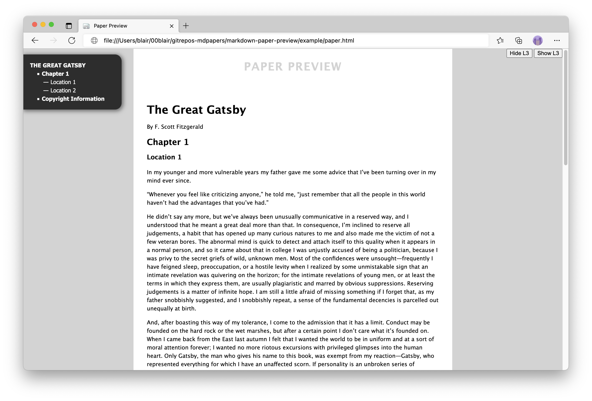

# markdown-paper-preview
Generate a HTML preview of a paper written in Markdown

## Screenshot

## Dependencies

- pandoc
- yarn (only if you need to update jQuery / add other dependencies)

## See also

- https://github.com/blairw/OneFileWonder

## Credits for the favicon

Icon by [Yusuke Kamiyamane](http://p.yusukekamiyamane.com/). Licensed under a [Creative Commons Attribution 3.0 License](http://creativecommons.org/licenses/by/3.0/).
